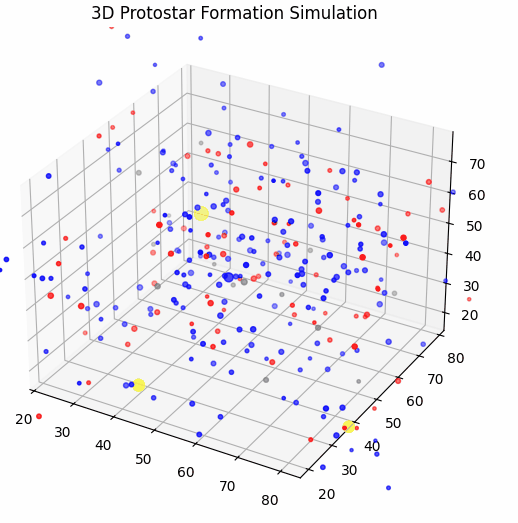

# Protostar Formation Toy Simulations

This repository contains a series of **Python toy simulations** that visualize the formation of protostars, protoplanetary disks, and planetary embryos from clouds of hydrogen, helium, and dust. These examples are **educational visualizations**, designed to illustrate the basic physics of star formation in a simplified way.

> ⚠️ **Note:** These are not full astrophysical simulations. They approximate gravity, rotation, accretion, and simple feedback effects, but do **not** include full hydrodynamics, magnetohydrodynamics, radiative transfer, or realistic timescales.

---

## Files / Examples

1. **`2d_protostar.py`**  
   - A 2D simulation of gas and dust particles merging under gravity.  
   - Protostars form as particles merge and grow in mass.  
   - Particles are color-coded by type:  
     - Hydrogen = blue  
     - Helium = red  
     - Dust = gray  
     - Ignited protostar = yellow

2. **`3d_protostar_basic.py`**  
   - Extends the previous simulation to 3D.  
   - Adds simple pressure, rotation, accretion, and feedback effects.  
   - Shows clusters of particles forming 3D protostars.

3. **`3d_protostar_disks.py`**  
   - Builds on the 3D simulation by adding **protoplanetary disks** around ignited protostars.  
   - Nearby particles get tangential velocities to simulate orbital motion.  
   - Some disk particles condense into **planetary embryos** (colored orange).  
   - Demonstrates the visual sequence: cloud → protostar → disk → embryos.

